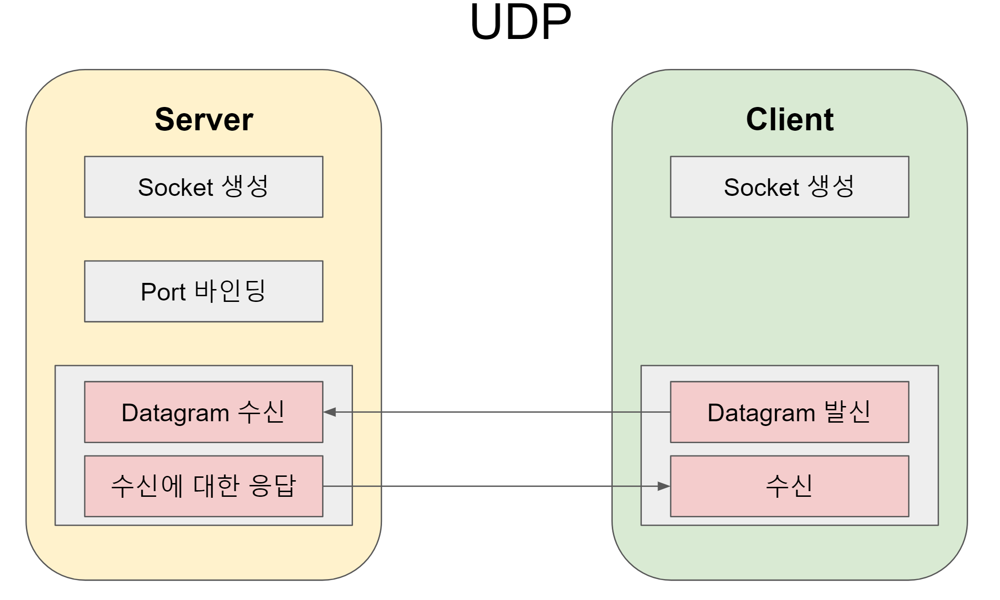
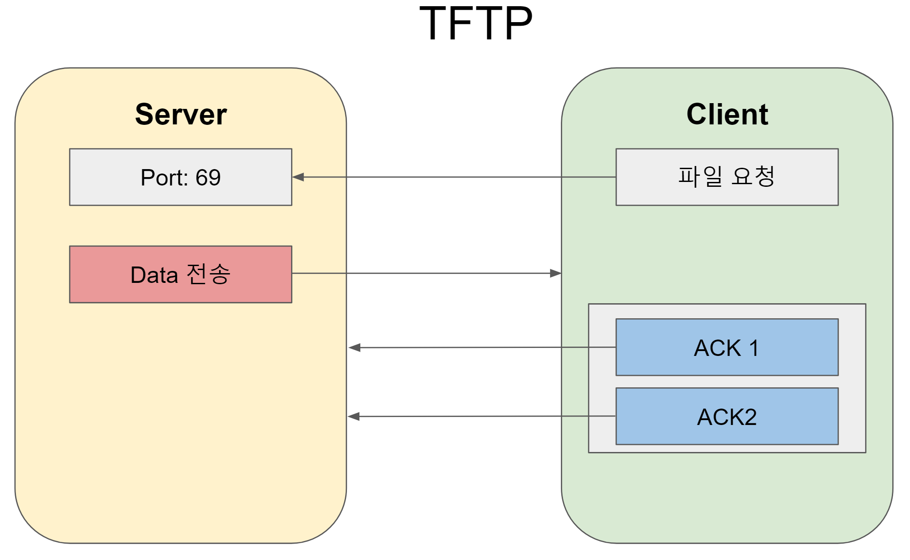

# UDP

packet 기반 메시지 전송에 최적화!
비교적 짧은 크기의 메시지(packet)를 전송.
목적지로 전송시 각 packet은 각기 다른 경로로 도착.
packet은 순서대로 도착하지 않을 수도 있으며 네트워크 상태가 좋지 않은 경우에는 도착하지 않을 수도 있다.

 * 특징
   * 짧은 사이즈
   * request/reponse가 포함
   * lost되는 경우에도 되풀이 전송하는 경우

## Broadcasting
 * UDP로 broadcasting이 가능
 * 하나의 IP로 datagram 전송
 * 수신하는 쪽은 동일한 port로 listen하고 있어야 가능
 * packet의 사이즈에 제한이 있음

## 주소 및 포트
 * IP 주소 형태
   * xxx.xxx.xxx.xxx
 * 127.0.0.1
   * 자기 자신 machine에 연결
 * UDP Port
   * 53
 * 0 - 1023
   * 중요하게 널리 사용되는 포트
   * Unix 시스템에서 
 * 1024 - 49151
   * OS에서 특별하게 취급되지 않는 포트
   * 특정 protocol에 대해서 IANA에 등록 가능.
   * IANA가 할당한 protocol로만 사용하는 것을 추천
 * 49152 - 65536
   * 자유롭게 사용
   * client가 어떤 port가 할당되었는지 신경쓰지 않아도 되도록 임의의 port를 생성
    
## 소켓
 * POSIX
 * server
   * datagram port를 열고 다양한 client로부터 packet를 수신
   * connect로 datagram socket에 연결
   * 이 주소로 보내면 해당 주소로 packet를 돌려보내는 방식
## 절차
 * socket 생성
 * datagram 수신
 * 수신에 대한 응답
 * datagram 발신
 * 응답 수신

## TFTP (Trivial File Transfer Protocol)
   
 * 인증이나 접근 관련 제어가 없음
 * 포맷
   * IP Header | UDP Header | Opcode | File Name | 0 | Mode | 0 |
   * Opcode | Block number | Data |
 * 커널 이미지 다운로드 받기, 작은 시스템에 사용


## UDP Server 및 Client
 ```go
 package main

 import(
     "fmt"
     "net"
     "os"
 )

 const (
     PORT = ":1000"

 )

func main() {
    ServerAddr, err := net.ResolveUDPAddr("udp", ":53")

    ServerCon, err := net.ListenUDP("udp", ServerAddr)
    defer ServerConn.Close()

    buf := make([]byte, 1024)

    for {
        n, addr, err := ServerConn.ReadFromUDP(buf)

    }
}

func client() {
    ServerAddr, err := net.ResolveUDPAddr("udp", "127.0.0.1:1000")

    LocalAddr, err := net.ResolveUDPAddr("udp", "127.0.0.1:0")

    Conn, err := net.DialUDP("udp", LocalAddr, ServerAddr)

    defer Conn.Close()
    i := 0
    for {
        msg := strconv.Itoa(i)
        buf := []byte(msg)
        _, err := Conn.Write(buf)
        if err != nil {
            fmt.Println(msg, err)
        }
        time.Sleep(time.Second * 1)
    }
}
 ```